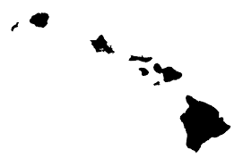
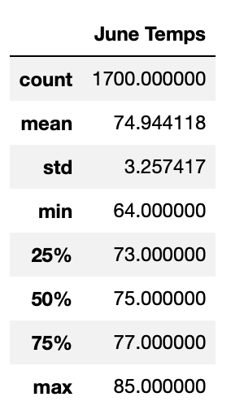
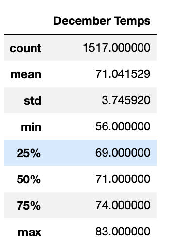

# surfs_up

## Table of Contents
- [1.0 Project Overview](#Project-Overview)
  * 1.1 Purpose
  * 1.2 Resources
  
- [2.0 Results](#Results)
  * 2.1 Process
  * 2.2 June vs December

- [3.0 Summary](#Summary)

## Project Overview
### 1.1 Purpose
A summary for the weather on Oahu needs to be conducted to get an understanding of when a surf and ice cream shop should be open to be sustainable year round. For this assignment a statistical analysis for the months of June and December is to be conducted providing an output summary. 

### 1.2 Resouces
- Data Source: hawaii.sqlite
- Software: Python 3.6.1
- Libraries: sqlalchemy, pandas

## Results

### 2.1 Process

Data was extracted from the hawaii.sqlite database utilizing sqlalchemy. An engine was created and references to the tables within the database were created. Next the data is querried to extract the temperatures for June and December.  The data is convereted into a list and then loaded into a pandas dataframe to create a summary of the temperatures for the given months.  

### 2.2 June vs December

* The temperature in June and December are essentially the same on Oahu with a low ranging between 56-64 and high of 83-85 degrees. 
* The average temperature is in the low 70s. 
* The number of points collected is over 1500, which provides for a good analysis for temperatures exhibited in the months of June and December. 

June Summary:                                      December Summary: 
       
 
 

## Summary

Based on the temperature it would be good to open an ice cream and surf shop, although further analysis should be conducted before opening the shops. Overall, the temperature is comparable between June and December with average temperatures in the low 70's.

1. How much percipitation is received, and which month has the highest precipitation?
2. Where on the island is the precipitation the greatest? Higher elevations only?
3. Which months have the best surfing conditions?

Additional queries can also be run to get more information for the months for example: 
* Precipitation for June and December 

  ` precipitation = engine.execute('SELECT prcp FROM Measurement WHERE date like "%-mm-%"')
  
* Elevation for June and December

  `elevation = engine.execute('SELECT Station.elevation FROM Station INNER JOIN Measurement ON Station.station = Measurement.station WHERE Measurement.date like "%-mm-%"')

 mm = 06 or 12
